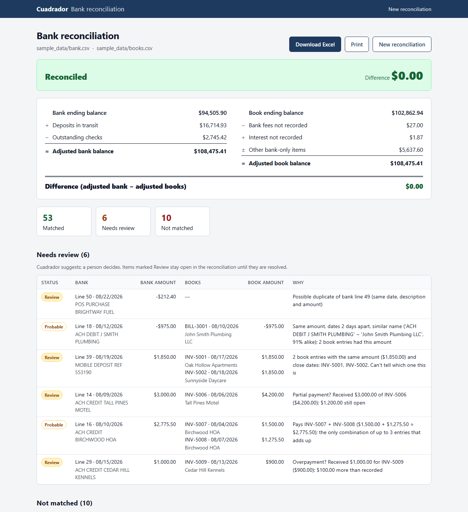
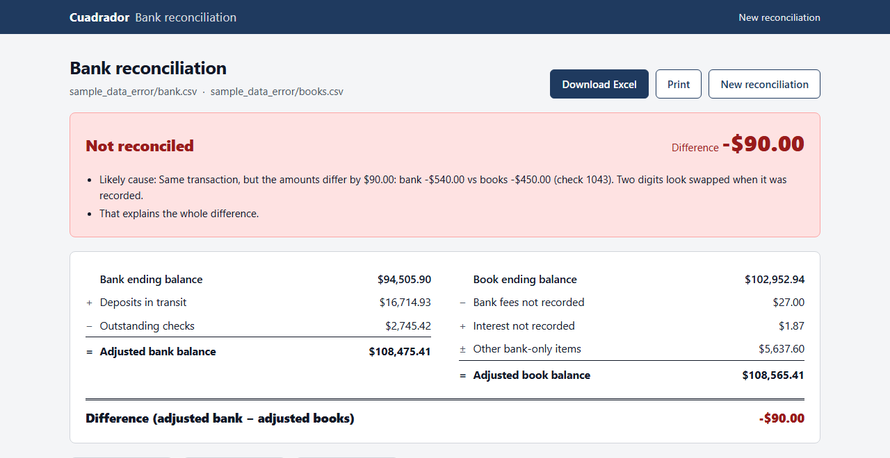
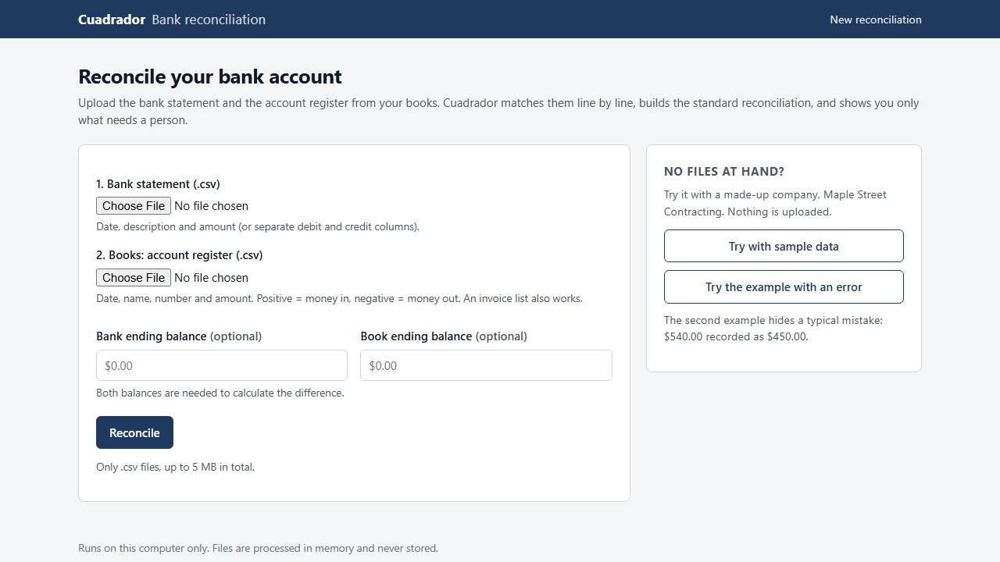

# Cuadrador — bank reconciliation for small businesses

Every month, someone at a small business or a bookkeeping office sits down with two lists — the bank statement and the checking account register from the books — and ticks them off against each other, line by line, until the numbers agree. It is slow, it is easy to lose your place, and the few lines that actually matter are buried under dozens that match without any trouble.

**Cuadrador does the ticking for you.** You give it the two files. It pairs every bank line with its entry in the books, builds the standard bank reconciliation an accountant expects, and shows you **only what needs a person**: the lines it could not match, the ones it is unsure about, and, if the books don't balance, the most likely reason why.

*"Cuadrar" is Spanish for "to make the numbers add up."*



## What you get

**The standard reconciliation, ready to review or print**

```
Bank ending balance
+ Deposits in transit
− Outstanding checks
= Adjusted bank balance

Book ending balance
− Bank fees not recorded
+ Interest not recorded
± Other bank-only items
= Adjusted book balance

Difference            ← $0.00 when everything is explained
```

Green means the account reconciles. Red means it doesn't, and Cuadrador tells you where to look first.

**A clear reason for every decision.** Each pairing says why it was made, in plain words: *"Same amount and check 1042 in the bank description"*, *"Same amount, dates 3 days apart, only possible match"*. You can trust it or correct it.

**Help with the hard cases.** Cuadrador flags these instead of guessing:

| Situation | What Cuadrador does |
|---|---|
| Name written differently (`J SMITH PLUMBING` vs `John Smith Plumbing LLC`) | Pairs them by name similarity and marks the pair **Probable** |
| Two entries with the same amount, and nothing to tell them apart | Shows both and asks you to pick one |
| One deposit that covers two or three entries | Finds the combination. If only one combination fits, marks it **Probable**; if several fit, lists all the options |
| Partial payment or overpayment | Shows how much came in, how much is still open, and which entry it belongs to |
| The same bank line appearing twice | Flags it as a possible duplicate |
| Bank fees and interest not yet recorded | Lists them as reconciling items |
| Checks not yet cashed, deposits not yet in the bank | Lists them as outstanding checks and deposits in transit |
| A number typed with two digits swapped ($540 recorded as $450) | Pairs the two lines and points to them as the likely cause of the difference. A difference divisible by 9 is the classic sign |



**An Excel workbook** with the reconciliation on its first sheet, set up to print on one page width. It also has one sheet each for matched lines, lines to review and unmatched lines.

## How to use it



1. **Export the bank statement as a CSV file.** Most online banking sites can download account activity for a date range as CSV. You need a date, a description and an amount, or separate debit and credit columns.
2. **Export the account register from your accounting software as a CSV file.** In QuickBooks and similar programs, this is the transaction list or register for the checking account you are reconciling, for the same period. A plain list of invoices and bills also works.
3. **Note both ending balances:** the one printed on the bank statement and the one in your books for the same date. They are optional, but without them Cuadrador can match the lines but cannot calculate the difference.
4. Open Cuadrador, choose the two files, enter the balances and click **Reconcile**.

Banks format their files differently. Cuadrador recognizes common column names and skips lines of text at the top of the file, such as the bank name or the account ending in 0000. If it doesn't recognize your columns, it asks you once which column is the date, the amount and so on, and can remember that layout for next time.

No files at hand? Click **Try with sample data** or **Try the example with an error**. Both use a made-up company, *Maple Street Contracting*.

## Privacy

- Cuadrador runs **on your own computer**. It is not a website and it doesn't send anything anywhere.
- Your files are read **in memory** and are **never saved** to disk. When you close the program, they are gone.
- It never connects to your bank or to your accounting software. You decide which files it sees.

## What it does and doesn't do

**It does:**
- Match bank lines to book entries: by check or invoice number, by amount and date, and by name similarity.
- Build the standard reconciliation from the two ending balances.
- Explain every pairing and flag every case it is unsure about.
- Export everything to Excel.

**It doesn't:**
- **Read PDF statements.** It only reads CSV files.
- **Connect to your bank or to QuickBooks.** You export and upload the files yourself.
- **Make the final call.** Cuadrador *suggests*; a person *decides*. Partial payments, duplicates and ambiguous matches stay open until you resolve them.
- **Change your books.** It tells you what to record; you record it.
- **Handle several accounts at once.** It reconciles one account per run.

## Running it

You need Python 3 (tested with Python 3.14).

```bash
git clone git@github.com:d2fzrsthmj-source/cuadrador.git
cd cuadrador
python3 -m venv venv
source venv/bin/activate
pip install -r requirements.txt

python app.py          # then open http://127.0.0.1:5001
```

The web app listens only on `127.0.0.1`, so only this computer can open it.

From the command line:

```bash
python reconcile.py sample_data/bank.csv sample_data/books.csv
python reconcile.py sample_data_error/bank.csv sample_data_error/books.csv
python reconcile.py my_bank.csv my_books.csv --bank-balance 12,345.67 --book-balance 11,980.20
```

This prints the reconciliation and saves `output/reconciliation.xlsx`.

To run the tests:

```bash
pytest
```

All sample data is invented and is generated by `tools/make_sample_data.py` with a fixed seed.

## Built by

A developer who builds automation tools for small businesses, with help from [Claude Code](https://claude.com/claude-code).
